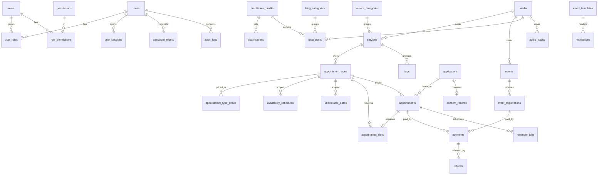

# Database Design

MySQL 8 (InnoDB, `utf8mb4_0900_ai_ci`). All timestamps are stored in **UTC** as `DATETIME`; the IANA time zone used for display is stored alongside where it matters (`appointments.client_timezone`, `events.timezone`, `availability_schedules.timezone`). Money is stored as integer **minor units** (`amount_minor`) plus an ISO-4217 `currency`.

Migrations live in `backend/database/migrations` and are applied with `php bin/console migrate`. Production schema changes are made only through migrations.

## 1. ERD



## 2. Tables

| Group | Table | Notes |
| --- | --- | --- |
| Identity | `users` | `email` unique, `password_hash` (Argon2id), `totp_secret_enc`, `failed_logins`, `locked_until` |
| | `roles`, `permissions`, `role_permissions`, `user_roles` | RBAC; permissions are slugs like `applications.view_confidential` |
| | `user_sessions` | Opaque session tokens stored as SHA-256 hash; CSRF token hash; idle + absolute expiry |
| | `password_resets` | Single-use, hashed token, 30-minute expiry |
| | `rate_limits` | Fixed-window counters keyed by HMAC of (bucket, IP/email) |
| Content | `pages` | `slug`, `type` (`page`/`legal`), structured `sections` JSON, publish state |
| | `practitioner_profiles`, `qualifications` | Credentials are admin-entered only; nothing is seeded as fact |
| | `service_categories`, `services`, `faqs`, `testimonials`, `cities` | `services.booking_mode` ∈ `direct`, `application`, `inquiry` |
| | `blog_categories`, `blog_posts` | Author = practitioner profile |
| | `media`, `audio_tracks` | `media.disk` ∈ `public`, `private`; audio files always private |
| | `seo_metadata`, `settings` | `settings.is_public` controls exposure via `/api/v1/settings/public` |
| Booking | `appointment_types`, `appointment_type_prices` | One price row per currency |
| | `availability_schedules`, `unavailable_dates` | Weekly rules (local time + TZ) and blackout ranges (UTC) |
| | `appointment_slots` | Holds and bookings; overlap checks run under a practitioner row lock |
| | `appointments` | State machine (below), encrypted client fields, Google event linkage |
| | `reminder_jobs` | One row per (appointment, offset, channel); cancelled on reschedule/cancel |
| Applications | `applications`, `consent_records`, `data_requests` | Encrypted fields, blind index on email |
| Payments | `payments`, `refunds`, `webhook_events` | One `payments` row per checkout attempt, with a public `reference`; `webhook_events (gateway, event_id)` unique → duplicate protection; `refunds.idempotency_key` unique (up to 100 characters) → a refund is never sent twice |
| Events | `events`, `event_prices`, `event_registrations`, `event_reminders_sent` | One price row per currency; tax, registration window, waitlist and cancellation policy on `events`; seat quota enforced under a lock; registrations store subtotal, tax and total |
| History | `status_history` | Every status change for applications, appointments, registrations, payments and refunds, with source and acting admin; notes never contain personal or payment data |
| Integrations | `calendar_integrations` | OAuth tokens encrypted; one active connection per environment |
| Messaging | `email_templates`, `notifications`, `jobs` | Outbox + generic job queue with backoff |
| Audit | `audit_logs` | Actor, action, entity, hashed IP; never confidential content |

## 3. State machines

**Application**: `draft → submitted → under_review → (info_requested ↔ under_review) → approved → invited → converted` (when the invitation is used to book); `→ rejected`; any → `archived`.

**Appointment**:

```
pending_application ─▶ awaiting_approval ─▶ pending_payment ─▶ payment_verification ─▶ confirmed ─▶ completed
                                                │                     │                   │  ▲
                                                ▼                     ▼                   ▼  │
                                         payment_failed ◀─────────────┘              rescheduled
                                                                                         │
                         confirmed / rescheduled / pending_payment ─▶ cancelled ─▶ refunded
```

Also: unpaid `pending_payment` / `payment_failed` → `expired` (scheduler; a later verified payment can still confirm it if the time is free), and `confirmed` → `no_show` (admin, after the start time). Meeting creation is tracked separately in `calendar_sync_status` (`pending → processing → synced`, or `retry_required → failed`).

Payment-exempt types jump from details straight to `confirmed`. Transitions are enforced by `App\Services\Booking\AppointmentStateMachine`.

**Payment**: `created → pending → captured → partially_refunded → refunded`; `→ failed` / `cancelled`; a capture whose amount or currency doesn't match goes to `reconciliation_required` until an admin accepts or refunds it.

**Event registration**: `pending_payment` (place held until `hold_expires_at`) `→ confirmed`; `→ expired` if unpaid (can be re-held at checkout while places remain); `waitlisted → pending_payment` when a place is offered; any open state `→ cancelled → refunded` when a paid place is refunded. Free events go straight to `confirmed`; invitation-only events start at `pending_application`.

## 4. Encryption at rest

| Table | Encrypted columns (`*_enc`) | Blind index (`*_bidx`) |
| --- | --- | --- |
| `applications` | full name, email, phone, city, professional background, designation, organization, core objective, preferred availability, referral details, confidential notes, admin notes | email |
| `appointments` | client name, email, phone, notes, Meet URL | email |
| `event_registrations` | name, email, phone, notes | email |
| `notifications` | recipient, payload | — |
| `calendar_integrations` | access token, refresh token | — |
| `users` | TOTP secret | — |
| `data_requests` | email | email |

* Cipher: AES-256-GCM (`openssl`), random 96-bit nonce per value, 128-bit tag, column name bound as AAD (prevents ciphertext swapping between columns).
* Envelope: `v{keyVersion}.{base64url(nonce‖tag‖ciphertext)}`.
* Keys: `ENCRYPTION_KEYS="1:base64key,2:base64key"`, `ENCRYPTION_ACTIVE_KEY=2`. Old versions remain for decryption; `php bin/console keys:rotate` re-encrypts rows to the active version in batches.
* Blind index: `HMAC-SHA256(BLIND_INDEX_KEY, normalize(value))` truncated to 32 bytes hex — enables exact-match lookup without storing plaintext.
* Fields used for filtering/sorting (status, dates, service, country, referral source enum) are kept plaintext deliberately.

## 5. Retention

`settings.privacy.retention` controls automatic purging (via scheduler): rejected/archived applications (default 365 days), completed appointments' confidential notes (default 730 days; financial records retained per tax law), unsubmitted drafts (30 days), sessions/resets/rate limits (expired rows daily).
